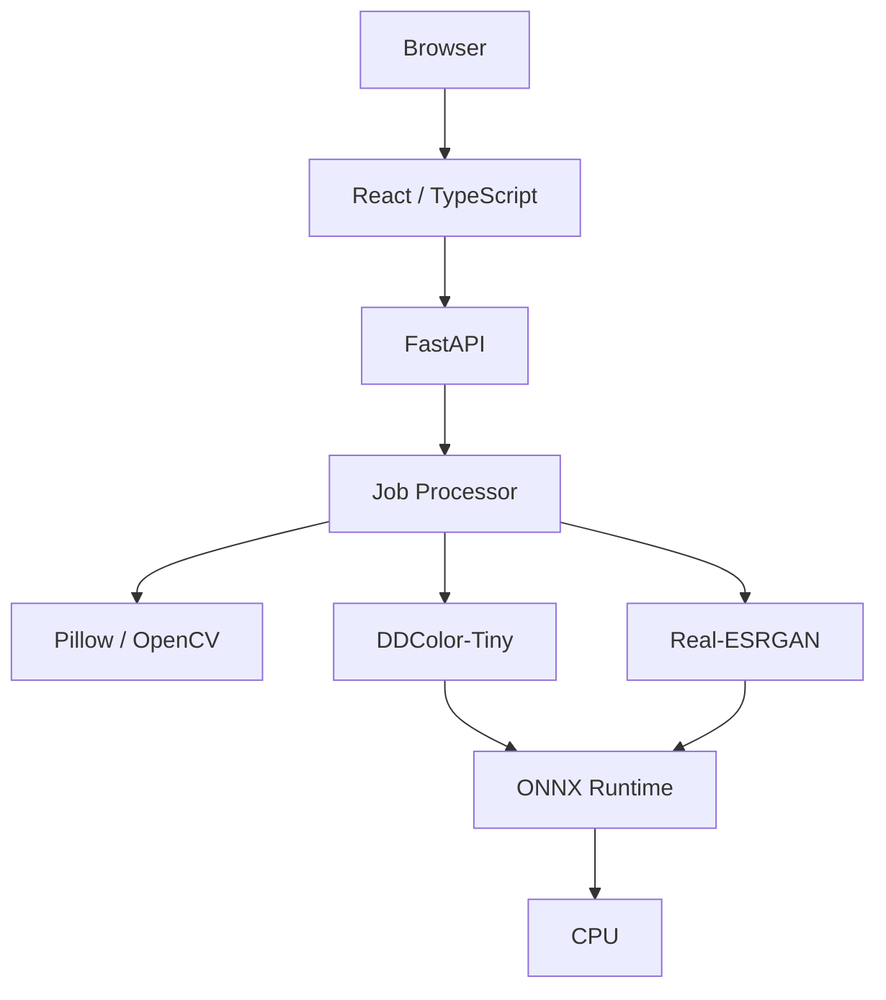

# Repix

A privacy-focused image processing workspace for editing, colorizing, and upscaling images — built to run entirely on CPU.

```text
React · TypeScript · FastAPI · ONNX Runtime · Docker
```

## Preview

<!-- Add a screenshot or short screen recording of the editor here once available. -->

## Features

- Drag-and-drop image upload with instant local preview
- Interactive crop (free, 1:1, 4:3, 3:2, 16:9)
- Resize with locked/unlocked aspect ratio and percentage presets
- Grayscale-to-color photo colorization
- AI upscaling at 2×
- AI upscaling at 4× (dedicated model, not the 2× model run twice)
- Before/after comparison slider
- Keep an AI result and continue editing (crop, resize, colorize, upscale) from the latest version
- Download as PNG, JPG, or WebP, with the exact file size and dimensions shown for each option
- Asynchronous, CPU-based AI processing with job status polling
- Responsive interface (desktop and mobile)
- Ephemeral processing storage — no persistent image storage
- Dockerized frontend and backend
- No GPU required

## AI Models

Repix uses two fixed, purpose-specific ONNX models. Both run through [ONNX Runtime](https://onnxruntime.ai/) on `CPUExecutionProvider`, using FP32 — no CUDA, no GPU, no external inference API.

### Colorization

**[DDColor-Tiny](https://github.com/piddnad/DDColor)**

Used for grayscale → color conversion. The image is processed locally as part of an asynchronous backend job; no image data is sent to a third-party service.

### Upscaling

**[Real-ESRGAN](https://github.com/xinntao/Real-ESRGAN) x2plus** — used for 2× upscaling.
**Real-ESRGAN x4plus** — used for 4× upscaling.

4× upscaling uses the dedicated `RealESRGAN_x4plus` model rather than chaining the 2× model twice. Large inputs are processed in overlapping tiles to bound memory usage.

Model provenance and exact source files are documented in [`DECISIONS.md`](./DECISIONS.md). Repix does not claim any output-quality superiority beyond what these upstream projects document — results depend on the source image.

## Privacy by Design

- No user accounts, no login, no sessions tied to identity.
- Uploaded images and generated results are written to a per-job temporary directory and are not permanently stored.
- There is no persistent image gallery or history.
- Temporary job files are deleted after the job's result is downloaded, and independently by a background cleanup process once a job exceeds its configured TTL (`JOB_TTL_MINUTES`) — whichever happens first.
- Refreshing or reopening the app always starts a clean session; no image state is kept in `localStorage`, `sessionStorage`, or a database.
- Images are processed locally by the backend's ONNX Runtime engines — they are never sent to an external AI API.

This describes what the current implementation does. It is not a compliance or legal guarantee.

## Architecture



The frontend handles upload, preview, crop, and resize locally in the browser — these operations never touch the backend. Colorization and upscaling are submitted as jobs to the FastAPI backend, which queues them on a bounded worker pool and runs inference through ONNX Runtime. The frontend polls job status and downloads the result once it's ready. All job data lives under a temporary, per-job directory on the backend's filesystem and is cleaned up automatically. The whole stack is distributed as two Docker images (frontend, backend) intended for a single CPU-only host.

## Tech Stack

| Layer            | Technology                 |
| ---------------- | --------------------------- |
| Frontend         | React + TypeScript + Vite   |
| Styling          | Tailwind CSS                |
| Crop UI          | react-image-crop            |
| Backend          | FastAPI                     |
| Image processing | Pillow / OpenCV             |
| AI inference     | ONNX Runtime (CPU)          |
| Colorization     | DDColor-Tiny                |
| Upscaling        | Real-ESRGAN (x2plus/x4plus) |
| Rate limiting    | slowapi                     |
| Containerization | Docker                      |
| Deployment       | Linux VPS                   |

## Requirements

- Docker and Docker Compose
- A Linux, macOS, or Windows host capable of running Docker
- No GPU — all inference runs on CPU

AI processing time is not fixed. It depends on CPU performance, input image resolution, the selected operation, and the upscaling factor (4× is substantially more compute-intensive than 2×). Larger images also require more RAM during inference.

## Quick Start

```bash
git clone <repository-url>
cd repix
./start.sh
```

`start.sh` checks Docker, creates `.env` if missing, builds the images only if they don't exist yet, starts whatever isn't already running, and waits until the app is actually serving. Run `./start.sh --build` after pulling code changes to rebuild, or `./start.sh --logs` to follow logs. Stop with `./stop.sh` (keeps containers and images for a fast restart), `./stop.sh --down` (removes containers), or `./stop.sh --purge` (also removes the built images, after asking). Both scripts are safe to re-run. Plain `docker compose up --build` still works too.

Then open:

```text
http://localhost:5173
```

The backend API is available separately at `http://localhost:8000` (see [`docker-compose.yml`](./docker-compose.yml)).

## Development

### Frontend

```bash
cd frontend
npm install
npm run dev
```

Runs the Vite dev server on `http://localhost:5173` and proxies `/api` requests to `http://localhost:8000`.

### Backend

```bash
cd backend
python3 -m venv .venv && source .venv/bin/activate
pip install -r requirements-dev.txt
bash ../models/download_models.sh
MODELS_DIR=../models uvicorn app.main:app --reload --port 8000
```

`models/download_models.sh` fetches and checksum-verifies the pinned ONNX weights (~270 MB) into `models/`.

### Docker

```bash
docker compose up --build
```

Rebuilds and starts both containers using the `.env` file at the repository root.

## Configuration

Copy `.env.example` to `.env` before running the project:

```bash
cp .env.example .env
```

| Variable               | Description                                   | Default      |
| ---------------------- | ---------------------------------------------- | ------------ |
| `APP_ENV`               | Application environment label                  | `production` |
| `LOG_LEVEL`             | Log verbosity                                  | `INFO`       |
| `MAX_UPLOAD_MB`         | Maximum upload size                            | `20`         |
| `MAX_INPUT_WIDTH`       | Maximum accepted input width (px)              | `6000`       |
| `MAX_INPUT_HEIGHT`      | Maximum accepted input height (px)             | `6000`       |
| `MAX_OUTPUT_WIDTH`      | Maximum generated output width (px)            | `10000`      |
| `MAX_OUTPUT_HEIGHT`     | Maximum generated output height (px)           | `10000`      |
| `MAX_OUTPUT_PIXELS`     | Maximum generated output pixel count           | `50000000`   |
| `JOB_TTL_MINUTES`       | Minutes before an unclaimed job is cleaned up   | `60`         |
| `MAX_AI_WORKERS`        | Concurrent AI inference jobs                   | `1`          |
| `MAX_QUEUE_SIZE`        | Jobs allowed to wait behind running ones; more are refused with a "busy" message | `5` |
| `AI_THREADS`            | CPU threads per AI job (`0` = auto, follows the container's CPU limit) | `0` |
| `POLL_INTERVAL_MS`      | Suggested frontend polling interval             | `1500`       |
| `UPSCALE_TILE_SIZE`     | Tile size used for large-image upscaling (px); smaller = less RAM, slightly slower | `256`        |
| `UPSCALE_TILE_OVERLAP`  | Overlap between upscaling tiles (px)           | `16`         |
| `RATE_LIMIT_PER_MINUTE` | Per-IP limit on job creation                   | `10`         |

## Docker

The stack is two services, defined in [`docker-compose.yml`](./docker-compose.yml):

- **`backend`** — FastAPI + ONNX Runtime, built from [`docker/backend.Dockerfile`](./docker/backend.Dockerfile). Model weights are downloaded and checksum-verified during the image build via `models/download_models.sh`. Job data is written to a `tmpfs` mount at `/tmp/image-lab`, so it never touches a persistent volume.
- **`frontend`** — the Vite production build served by nginx, built from [`docker/frontend.Dockerfile`](./docker/frontend.Dockerfile), proxying `/api` to the backend container.

There is no persistent volume for user images in either service.

### Resource limits

The backend container is capped so a burst of large jobs can't starve the host (VPS or laptop). Defaults are set in [`docker-compose.yml`](./docker-compose.yml) and can be overridden in `.env`:

| Variable         | Default | Effect                                                              |
| ---------------- | ------- | ------------------------------------------------------------------- |
| `BACKEND_CPUS`   | `2`     | Hard CPU cap for the backend container                              |
| `BACKEND_MEMORY` | `4g`    | Hard RAM cap (swap disabled); `/tmp/image-lab` tmpfs is capped at 512 MB |

Work beyond that capacity queues instead of consuming more CPU: only `MAX_AI_WORKERS` jobs run at once, up to `MAX_QUEUE_SIZE` more wait (the UI shows the queue position), and anything past that gets a friendly "server is busy" response (HTTP 503). Inference threads automatically follow the container's CPU limit. Container logs are rotated (10 MB × 3), and the frontend container is capped at 0.5 CPU / 128 MB. Keep `BACKEND_CPUS` well below your host's core count.

```bash
docker compose up --build   # build and start both containers
docker compose down         # stop and remove containers
```

## Benchmarking & Deployment Testing

Repix targets a small CPU-only VPS (the reference target is a **2 vCPU / 8 GB** plan, e.g. Hostinger KVM 2), so its performance was *measured*, not guessed — and measured on a 16-core / 16 GB development machine without ever putting that machine at risk. The full 14-page write-up, with the math, tables and original-vs-upscaled comparisons, is in [`benchmarks/repix-model-comparison.pdf`](./benchmarks/repix-model-comparison.pdf).

### A benchmark harness that can't take the machine down

Every measurement runs in its own throw-away container limited to the deployment target, one at a time:

| Layer | Setting | Why |
| ----- | ------- | --- |
| CPU | `--cpus 2 --cpuset-cpus 0,1` | quota **and** pinning to two physical cores, so the app sees exactly 2 CPUs, like on the VPS |
| Memory | `--memory 8g --memory-swap 8g` | hard cap, no swap: overshoot means the *container* is OOM-killed, never the host |
| Isolation | `--network none --read-only --cap-drop ALL --pids-limit 256` | no network, nothing writable, no fork bombs |
| OOM priority | `--oom-score-adj 800` | if the host ever ran short, the kernel kills the benchmark first |
| Runner | pre-flight RAM/load checks, host-memory **watchdog**, per-run timeouts | a second line of defence independent of cgroups |

The harness records what the kernel's cgroup accounting says each run consumed (`cpu.stat`, `memory.current` sampled every 20 ms), so the caps are *verified*, not assumed: across all timed runs the container peaked at **2.00 cores and 3.2 GiB against an 8 GiB cap**.

### The math is checked against the model files

Cost is modelled analytically and then asserted against the ONNX graphs:

- Real-ESRGAN ×4 costs exactly **17,926,848 MAC per input pixel**, ×2 costs **4,483,008** — derived from the RRDBNet architecture and verified by summing every `Conv` node in the exported models (the report generator fails if they ever disagree).
- From that: tiling overhead η, predicted job time `t ≈ MAC / G`, and a fitted memory model (`peak ≈ 316 MiB + 1.93 × one feature map`, R² = 1.000 over four tile sizes) that can be used for admission control.

### Headline results (2 vCPU / 8 GB, shipped configuration)

| Job | Time | Peak RAM |
| --- | ---- | -------- |
| Colorize any image (fixed 512×512 network) | ~2.2 s | ~1.4 GiB |
| Upscale ×2, 512² → 1024² | ~11.7 s | ~0.6 GiB |
| Upscale ×4, 512² → 2048² | ~70 s | ~1.0 GiB |
| Upscale ×4, 1024² → 4096² | ~4 min 55 s | ~1.1 GiB |

Throughput is ~76 GMAC/s. Absolute times come from a fast laptop CPU emulating a 2 vCPU plan — re-measure on your own host and rescale with `t ≈ MAC / G`.

### Optimisations that were tested (and what they did)

Each technique was switched on/off in an otherwise identical, freshly created container, with the shipped configuration repeated three times to measure noise (~6 %):

| Experiment | Result |
| ---------- | ------ |
| Stock ONNX Runtime defaults on 2 vCPU | **+59 % time**; with only a CPU *quota* (host cores visible) ONNX Runtime spawns 16 threads and the kernel logged **523 s** of thread throttling inside a single 86 s job — the reason the app sizes its thread pool from the cgroup limit |
| Memory arena + memory-pattern ON | **−26 % time**, +59 % RAM (600×400); at 1024²→4096² −30 % time but 3.2 GiB RAM |
| Constant-shape tiles + arena + shrinkage | −21 % time at 1024²→4096²; **+38 % on a small image** because edge tiles get recomputed |
| Thread spinning, OpenMP/BLAS/OpenCV thread pinning, ONNX Runtime 1.23, tile 256 vs 384/512 | within noise |
| Skipping ORT's NCHWc layout transform (~20 % of kernel time in reorders) | **+12 % slower** — the transform pays for itself |
| Profiling the 4×-resolution tail as a bandwidth bottleneck | not supported: ~7 % of time for ~7.6 % of the MACs |

Negative and mixed results are reported as such, and the best setting depends on image size.

### Candidate models

Measured for the trade-off only; the shipped models are unchanged (see [`DECISIONS.md`](./DECISIONS.md)):

| Model | ×4 of a 600×400 photo | Peak RAM | Mean Y-PSNR (clean / degraded input) |
| ----- | --------------------- | -------- | ------------------------------------ |
| Real-ESRGAN x4plus FP32 (shipped) | 60.3 s | 920 MiB | 25.99 / 24.63 dB |
| x4plus INT8 (static QDQ, per-channel, held-out calibration) | 40.1 s (1.5×) | 921 MiB | 25.99 / 24.68 dB |
| realesr-general-x4v3 (compact) | 3.7 s (16×) | 332 MiB | 26.27 / 24.54 dB |

Quality was scored against ground truth (photos downsampled, then restored) with PSNR/SSIM plus side-by-side crops. Three small photos and no perceptual metric is a small sample, so treat quality verdicts as preliminary — the report says so too.

### Run it yourself

```bash
python benchmarks/make_quality_inputs.py WORK      # ground-truth test pairs
python benchmarks/run_benchmarks.py baseline --work WORK
python benchmarks/run_benchmarks.py ablation --work WORK
python benchmarks/make_report.py --work WORK --macs benchmarks/results/onnx_macs.json --out report.pdf
```

See [`benchmarks/README.md`](./benchmarks/README.md) for all stages. Raw results are checked in under [`benchmarks/results/`](./benchmarks/results).

## Testing

### Backend

```bash
cd backend
source .venv/bin/activate
pip install -r requirements-dev.txt
pytest
```

This runs unit tests (image validation, job lifecycle, cleanup) and API tests. `tests/test_engines.py` runs inference against the real ONNX models and is skipped automatically if `models/download_models.sh` hasn't been run yet.

### Frontend

```bash
cd frontend
npm test        # vitest
npm run build   # type checking (tsc -b) + production build
npm run lint    # oxlint
```

## Project Structure

```text
repix/
├── frontend/              React + TypeScript + Vite app
│   └── src/
│       ├── components/    UI components (dropzone, crop, resize, compare slider, ...)
│       ├── services/      Job API client
│       ├── state/         Shared types
│       └── utils/         Client-side image utilities (crop/resize via canvas)
├── backend/               FastAPI app
│   ├── app/
│   │   ├── api/           Routes (/health, /ready, /api/jobs)
│   │   ├── core/          Config and logging
│   │   ├── engines/       DDColor and Real-ESRGAN ONNX engines
│   │   ├── jobs/          Job manager, storage, cleanup
│   │   ├── models/        Job data model
│   │   └── schemas/       Pydantic request/response schemas
│   └── tests/
├── models/                Pinned ONNX weights, checksums, download script
├── benchmarks/            Capped-container benchmark harness, raw results, comparison report (PDF)
├── docker/                Dockerfiles and nginx config
├── docker-compose.yml
├── .env.example
├── DECISIONS.md           Fixed and resolved implementation decisions
├── PRD.md                 Product/technical specification
└── README.md
```

## Deployment

```text
Linux VPS
   ↓
Docker Compose
   ↓
CPU-only inference (ONNX Runtime, CPUExecutionProvider)
```

Repix does not require GPU infrastructure, NVIDIA drivers, or CUDA. Actual sizing depends on expected image resolution and concurrency — `MAX_AI_WORKERS` controls how many AI jobs run at once, and should generally be kept low (`1`) on small VPS instances since upscaling is CPU- and memory-intensive.

## Data Storage

```text
User image
   ↓
Temporary job directory (/tmp/image-lab/<job_id>)
   ↓
Processing (crop/resize client-side; colorize/upscale via ONNX Runtime)
   ↓
Download
   ↓
Cleanup (on download, or automatically after JOB_TTL_MINUTES)
```

**Persistent:** application code, Docker images, model weights, configuration.

**Temporary:** uploaded images, generated results, and all per-job files — removed after download or TTL expiry, whichever comes first.

## Limitations

- CPU inference is slower than GPU inference, particularly for 4× upscaling.
- Larger images require more RAM and more processing time.
- 4× upscaling can produce very large output files.
- Colorization is a model inference result — it is not guaranteed to reproduce historically accurate colors.
- Output quality depends on the source image and is not guaranteed for all content types.

## Roadmap

Ideas under consideration, not yet implemented:

- Batch processing of multiple images
- Additional input/output formats
- Additional enhancement models
- Finer-grained job cancellation
- Optional GPU execution path

## Contributing

1. Fork and clone the repository
2. Create a feature branch
3. Make your changes
4. Run the backend and frontend test suites
5. Open a pull request describing the change

## License

No license has been chosen for this repository yet.
<!-- TODO(maintainer): add a LICENSE file and reference it here once a license is chosen. -->

## Credits

Repix builds on top of the following open-source models and libraries. Repix does not claim authorship of these models — see each project for its own license terms.

- [DDColor](https://github.com/piddnad/DDColor) — colorization model
- [Real-ESRGAN](https://github.com/xinntao/Real-ESRGAN) — upscaling models
- [ONNX Runtime](https://onnxruntime.ai/) — inference engine
- [FastAPI](https://fastapi.tiangolo.com/), [Pillow](https://python-pillow.org/), [OpenCV](https://opencv.org/)
- [React](https://react.dev/), [Vite](https://vite.dev/), [Tailwind CSS](https://tailwindcss.com/)
